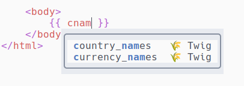

# cmp-twig-routes

[nvim-cmp](https://github.com/hrsh7th/nvim-cmp) source for twig.  
This plugin autocompletes twig filters and functions located in 
`src` directory.  
The native filters and functions are also available.

Filters:  


Functions:  


## Prerequisites
- [ripgrep](https://github.com/BurntSushi/ripgrep) to search for 
filters and functions

## Setup

```lua
require('cmp').setup({
  sources = {
    { name = 'twig' },
  },
})
```

## Triggers

The plugin is activated for `twig` filetype.  
There are three trigger characters:
- pipe triggers filters completion
- space and open parenthesis trigger functions completion

## Configuration

There is no configuration at the moment.

## Todo

- Refresh sources
- Configure filetypes
- Configure filters and functions location
